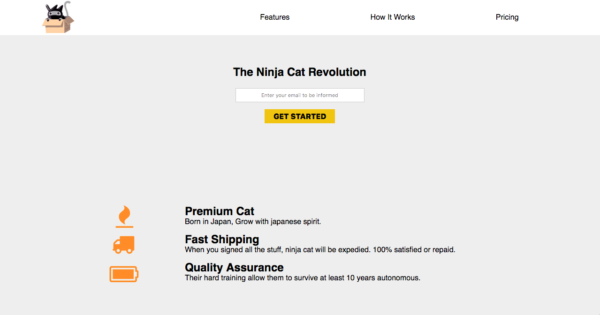
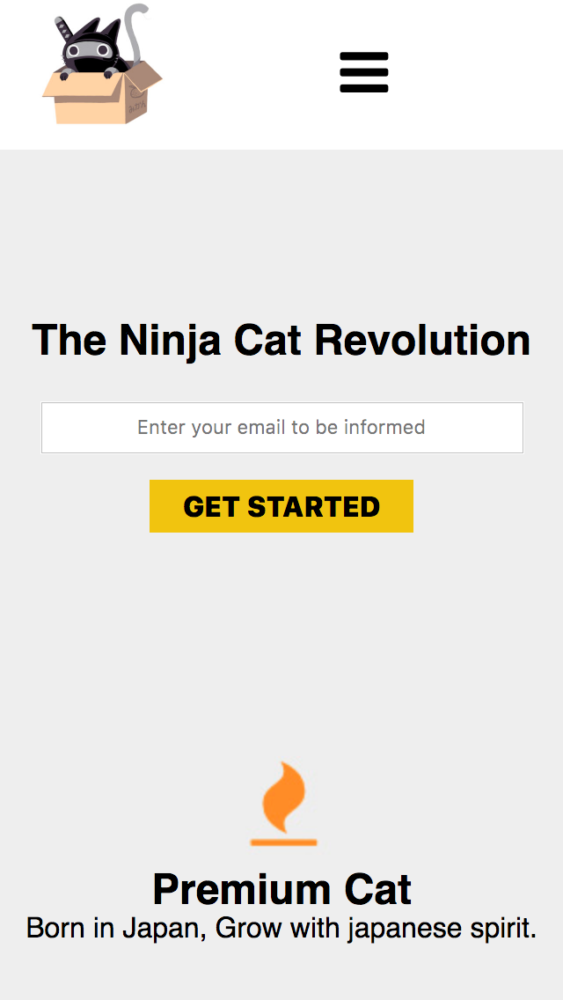

# ninja-cat
Responsive Web design - Build a Product Landing (Ninja Cat)

STEP 1
Run index.html file once you download/clone this project
Or just go in https://hddv.github.io/ninja-cat/

And Enjoy :)

<strong>Desktop:</strong> 
<kbd></kbd>

<strong>Mobile:</strong> 

